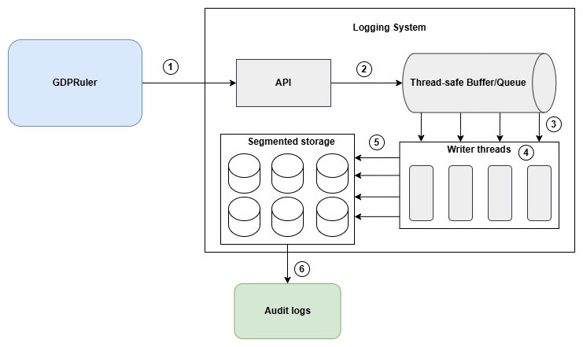

# GDPRlogger

## Overview

The **GDPRlogger** is a key component of the [GDPRruler](https://github.com/dimstav23/GDPRuler) project, which is designed to enforce compliance with the General Data Protection Regulation (GDPR) for key-value stores. This logging system acts as a tamper-evident, high-performance logging solution that tracks all transactions involving personal data. It ensures data processing activities are logged securely and in a way that supports auditing and reporting, with a focus on scalability, high write throughput, and data integrity.

## System Design

1. **Log Entry Creation**: When the GDPRuler engine processes a personal data related operation, it generates a log entry containing relevant metadata such as timestamps, action types, and data locations.
2. **Enqueuing**: Log entries are immediately enqueued through the Logger, allowing the calling process to continue without waiting for disk operations.
3. **Batch Processing**: Dedicated writer threads continuously monitor the queue, collecting entries into batches for optimized processing.
4. **Security Processing**: Batched entries undergo security treatments including compression and encryption, with cryptographic chaining applied to ensure tamper-evidence.
5. **Persistent Storage**: Processed batches are written to append-only segment files, with new segments created based on size or time thresholds.
6. **Export and Verification**: When required, closed segments can be exported for auditing purposes, with the system performing decryption, decompression, and hash chain verification to ensure data integrity throughout the export process.

## Features

- **High Write Throughput:** Focuses on fast write operations with minimal read requirements.
- **Tamper-Evident:** Cryptographic hashing of logs to detect any tampering.
- **Security:** Logs can be encrypted and protected with robust access control.
- **Scalable Concurrency:** Designed to handle high concurrency through dedicated writer threads and a thread-safe queue.
- **Occasional Export:** Logs are stored in append-only segments that can be exported or archived when needed.
